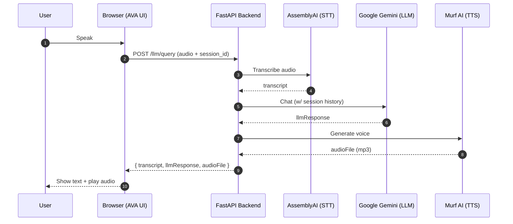

<p align="center">
  
</p>

<h1 align="center">AVA — Advanced Voice Assistant</h1>

<p align="center">
  A futuristic, PWA-ready voice assistant with a cinematic UI, real-time AI, and smart playback control.
  <br/>Speak naturally, see live transcriptions, hear lifelike replies, and preview music — all in one sleek UI.
</p>

<p align="center">
  <a href="https://img.shields.io/badge/Python-3.10%2B-3776AB?logo=python&logoColor=white"></a>
  <a href="https://img.shields.io/badge/FastAPI-⚡-009688?logo=fastapi&logoColor=white"></a>
  <a href="https://img.shields.io/badge/PWA-Ready-5A0FC8?logo=pwa&logoColor=white"></a>
  <a href="https://img.shields.io/badge/License-OSS-2ea44f"></a>
</p>

---

## ✨ Highlights

- **Conversational voice chat** with session memory
- **Text-only chat** for accessibility and quick testing
- **Music previews** via Spotify (with iTunes fallback)
- **Smart playback control** (barge‑in) between Murf TTS and Spotify
- **Beautiful, animated UI** (particles, waves, breathing avatar)
- **Installable PWA** with offline-safe assets and screenshots
- **Pluggable API keys** via UI with optional local encryption

<div align="center">
  
  <br/>
  <sub>Modern, cinematic UI designed for both desktop and mobile.</sub>
</div>

---

## 🧭 Table of Contents

1. [Features](#-highlights)
2. [Quickstart](#-quickstart-local)
3. [Architecture](#-architecture-overview)
4. [Playback Control](#-playback-control-bargein)
5. [API Reference](#-api-reference-core)
6. [Environment](#-environment--config)
7. [Project Structure](#-project-structure)
8. [Screenshots](#-screenshots)
9. [Testing](#-testing)
10. [Deployment](#-deployment)
11. [Roadmap](#-roadmap)
12. [License](#-license)

---

## 🚀 Quickstart (Local)

Prerequisites: Python 3.10+

```powershell
# Windows PowerShell
python -m venv .venv
. .\.venv\Scripts\Activate.ps1
pip install -r requirements.txt
# Add your keys to uploads/.env (see Environment)
python main.py
# Open http://localhost:8000
```

```bash
# macOS/Linux
python -m venv .venv
source .venv/bin/activate
pip install -r requirements.txt
# Add your keys to uploads/.env (see Environment)
python main.py
# Open http://localhost:8000
```

> Tip: In production on a single instance (Render Free/Starter), keep a single worker for WebSockets and in-memory sessions:
>
> `gunicorn -w 1 -k uvicorn.workers.UvicornWorker main:app`
>
> If you scale horizontally (multiple instances), move session state to Redis/DB and enable sticky sessions before increasing workers.

---

## 🧩 Architecture Overview



- **Text‑only flow**: `POST /llm/text-query` → returns `{ llmResponse }`.
- **Session storage**: in-memory by `session_id` (swap for Redis/DB as needed).

---

## 🎚️ Playback Control (Barge‑In)

To keep the experience natural and interruption‑friendly, AVA enforces:

- **Murf → Spotify**: If Murf TTS is playing, Spotify preview is paused.
- **Spotify → Murf**: If Spotify preview starts, Murf TTS stops.
- **User speech → All off**: When the mic is listening or speech is detected, any current playback (Murf/Spotify) stops immediately and the recording pipeline continues.

This prevents overlapping audio and ensures fast barge‑in during conversation.

---

## 📡 API Reference (Core)

Base URL: `http://localhost:8000`

- **GET /**
  - Serves the main UI

- **POST /generate-audio/**
  - JSON: `{ "text": string }`
  - Returns `{ audioFile }` (Murf TTS or fallback)

- **POST /tts/echo/**
  - Form‑Data: `file`
  - Returns `{ transcription, audioFile }`

- **POST /llm/query**
  - Form‑Data: `file`, `session_id`
  - Returns `{ userTranscription, llmResponse, audioFile }`

- **POST /llm/text-query**
  - JSON: `{ text, session_id }`
  - Returns `{ llmResponse }`

- **POST /chat/clear**
  - JSON: `{ session_id }`
  - Clears in‑memory history

---

## 🔐 Environment & Config

Create `uploads/.env`:

```ini
MURF_API_KEY=your_murf_key
ASSEMBLYAI_API_KEY=your_assemblyai_key
GEMINI_API_KEY=your_gemini_key
SPOTIFY_CLIENT_ID=your_spotify_client_id
SPOTIFY_CLIENT_SECRET=your_spotify_client_secret
TAVILY_API_KEY=your_tavily_key
WEATHER_API_KEY=your_weather_key
```

- Keys are loaded via `dotenv` in `main.py` and can be overridden via the in‑app settings modal.
- Optional local encryption is used for UI‑supplied keys when `cryptography` is available.
- Missing keys degrade gracefully (e.g., TTS falls back to `static/fallback.mp3`).

---

## 🗂️ Project Structure

```
AVA/
├─ main.py                      # FastAPI app: routes, skills, integrations
├─ templates/
│  └─ index.html                # Single‑page UI
├─ static/
│  ├─ script.js                 # Frontend logic (tabs, recording, chat, playback)
│  ├─ audio-worklet-processor.js# AudioWorklet to stream Float32 frames
│  ├─ manifest.json             # PWA manifest
│  ├─ icons/                    # PWA icons
│  ├─ screenshot-*.png          # PWA screenshots
│  └─ fallback.mp3              # Safe audio fallback
├─ sw.js                        # Service worker (network-first for code, cached assets)
├─ uploads/
│  ├─ .env                      # Local environment variables
│  └─ .env.example              # Example template
├─ requirements.txt             # Python dependencies
├─ render.yaml                  # Example deployment config
├─ test_ai_chat.py              # Quick API smoke test
└─ README.md                    # You are here
```

---

## 🖼️ Screenshots

<div align="center">
  
  <br/>
  
</div>

---

## 🧪 Testing

```bash
python test_ai_chat.py
```
Ensure the server is running at `http://localhost:8000`.

---

## ☁️ Deployment

- Set secrets securely (never commit `.env`).
- Example production command:

```bash
uvicorn main:app --host 0.0.0.0 --port 8000 --workers 2
```

- Reverse proxy (e.g., Nginx) should pass WebSocket and static routes.
- For multi‑instance or long sessions, persist chat sessions (e.g., Redis).

---

## 🗺️ Roadmap

- Real‑time streaming TTS with smooth cross‑fade
- On‑device VAD tuning and sensitivity slider
- Multi‑voice profiles and style tags (cheerful, narrator, whisper)
- Rich cards (links, images, citations) in chat bubbles
- Persistent session storage and multi‑device sync

---

## 📄 License

All Rights Reserved

Copyright (c) 2025 Bipul Shukla

This source code and its contents are the exclusive property of Bipul Shukla.
Unauthorized use, copying, modification, merging, publishing, distribution, sublicensing, 
or sale of this code or any derivative works is strictly prohibited.

You may not:
- Use this code for any purpose without prior written permission.
- Copy, modify, merge, publish, distribute, sublicense, or sell copies of the code.
- Create derivative works from this code.

For inquiries regarding usage rights, please contact: iambipulshukla@gmail.com .
Check the licenses and usage limits for APIs before deploying to production.


